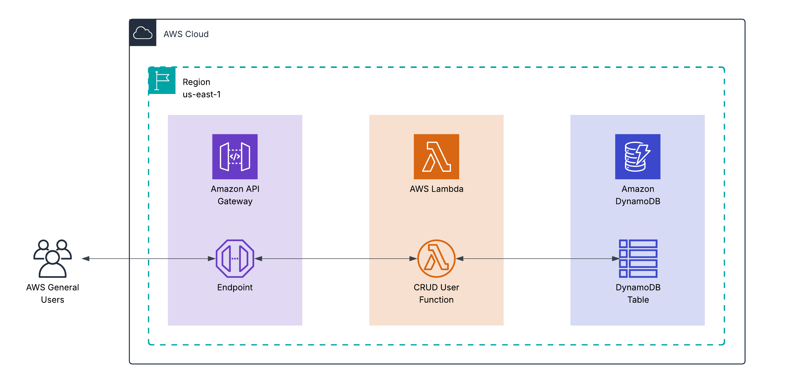

# 🚀 Serverless User Management API on AWS

> A serverless REST API for performing CRUD operations on user data, built with API Gateway, Lambda, and DynamoDB, and deployed via Terraform.

---

## **📝 1. Project Overview**

This project provides a complete backend solution for managing user profiles. It is built entirely on serverless AWS services, ensuring scalability, low maintenance, and cost-effectiveness. The infrastructure is defined using Terraform, allowing for automated and repeatable deployments.

* **Purpose/Goal:** To create a robust, scalable, and cost-efficient REST API for standard user management operations (Create, Read, Update, Delete).
* **Target Audience:** Developers needing a backend for an application, and DevOps Engineers managing cloud infrastructure.

---

## **🗺️ 2. Architecture**

This project uses a classic serverless pattern. An API Gateway exposes HTTP endpoints to the public, which trigger a single Lambda function that acts as a request router and handler. This function then interacts with a DynamoDB table to persist user data.

### **Architecture Diagram**



* **Workflow:** A client sends an HTTPS request to an API Gateway endpoint. The gateway triggers the Node.js Lambda function, passing the request details. The Lambda function processes the request, performs the necessary CRUD operation on the DynamoDB table, and returns a JSON response through the API Gateway.

### **AWS Services Used**

* **API Gateway**: Provides the public RESTful API endpoints (`/users` and `/users/{userId}`) and handles request/response mapping.
* **AWS Lambda**: Runs the backend logic in a Node.js 20.x environment. It contains a single function that routes requests to the appropriate logic for handling CRUD operations.
* **Amazon DynamoDB**: A fully managed NoSQL database used to store user information. The table uses on-demand (`PROVISIONED`) capacity.
* **IAM**: Manages the execution role and policies for the Lambda function, granting it least-privilege access to DynamoDB and CloudWatch Logs.
* **Amazon CloudWatch**: Automatically collects logs and metrics from the Lambda function and API Gateway for monitoring and debugging.

### **Component Breakdown**

* **API Gateway:** Serves as the primary public-facing interface, with the following endpoints configured:
    * `POST /users`: Creates a new user.
    * `GET /users`: Retrieves a list of all users.
    * `GET /users/{userId}`: Retrieves a specific user by their ID.
    * `PATCH /users/{userId}`: Updates a specific user's attributes.
    * `DELETE /users/{userId}`: Deletes a specific user.
* **AWS Lambda:** The core of the application. The `index.mjs` file acts as a router, inspecting the incoming event's `httpMethod` and `resource` path to execute the corresponding database operation. It uses the AWS SDK v3 for JavaScript.
* **Amazon DynamoDB:** A single table is created with `userId` as the string-based primary key. It stores user objects.

---

## **🚀 3. Deployment & Configuration**

The entire stack is defined in Terraform and can be deployed with a few commands.

### **Prerequisites**

* An AWS Account
* `AWS CLI` configured with appropriate permissions
* `Terraform`
* `Node.js` (v20.x or later, to match the Lambda runtime)

### **Deployment Steps**

1.  **Clone the repository:**
    ```bash
    git clone [URL_to_your_repo]
    cd [project-directory]
    ```

2.  **Initialize Terraform:**
    This command downloads the necessary provider plugins.
    ```bash
    terraform init
    ```

3.  **Plan the deployment:**
    This command shows you what resources will be created.
    ```bash
    terraform plan
    ```

4.  **Apply the configuration:**
    This command builds and deploys all the AWS resources.
    ```bash
    terraform apply
    ```

### **Manual Setup Steps**

There are no manual setup steps. All resources are provisioned by Terraform.

---

## **⚙️ 4. Usage & Operations**

After deployment, the API can be accessed through the API Gateway endpoints.

### **Access Points / API Endpoints**

The API is deployed to a stage named `v1`. The base URL will be similar to: `https://{api-id}.execute-api.{region}.amazonaws.com/v1`

**1. Create a User**
* **Endpoint:** `POST /users`
* **Example Request Body:**
    ```json
    {
      "email": "jane.doe@example.com",
      "firstName": "Jane"
    }
    ```

**2. Get All Users**
* **Endpoint:** `GET /users`

**3. Get a Specific User**
* **Endpoint:** `GET /users/{userId}`

**4. Update a User**
* **Endpoint:** `PATCH /users/{userId}`
* **Example Request Body:**
    ```json
    {
      "firstName": "Janet"
    }
    ```

**5. Delete a User**
* **Endpoint:** `DELETE /users/{userId}`

### **Monitoring & Logging**

* **Logs:** All Lambda function logs are streamed to **Amazon CloudWatch** under a log group named after the function (e.g., `data-lambda-unique-name`).
* **Metrics:** Key performance metrics for both API Gateway (latency, error rates) and Lambda (invocations, duration, errors) can be found in their respective **CloudWatch Metrics** dashboards.
* **Alarms:** No custom alarms are configured in this project by default.

---

## **🛡️ 5. Security**

* **IAM Roles & Policies:** The principle of *least privilege* is applied. The Lambda execution role grants only the permissions required by the function's code:
    * `logs:CreateLogGroup`, `logs:CreateLogStream`, `logs:PutLogEvents` for writing logs.
    * `dynamodb:PutItem`, `dynamodb:Scan`, `dynamodb:GetItem`, `dynamodb:UpdateItem`, `dynamodb:DeleteItem` on the specific DynamoDB table resource.

* **Data Security:**
    * **Encryption at Rest:** Data in the DynamoDB table is automatically encrypted at rest by default.
    * **Encryption in Transit:** All API Gateway endpoints require HTTPS, ensuring data is encrypted with TLS during transit.

---


## **💰 6. Cost**

* **Cost Estimation:** This architecture is extremely cost-effective and falls well within the AWS Free Tier for low-to-moderate traffic.

* **Cost Optimization:**
    * The serverless model means you pay nothing for idle time.
    * DynamoDB is configured with `PROVISIONED` billing to be eligible for the AWS Free Tier
---
